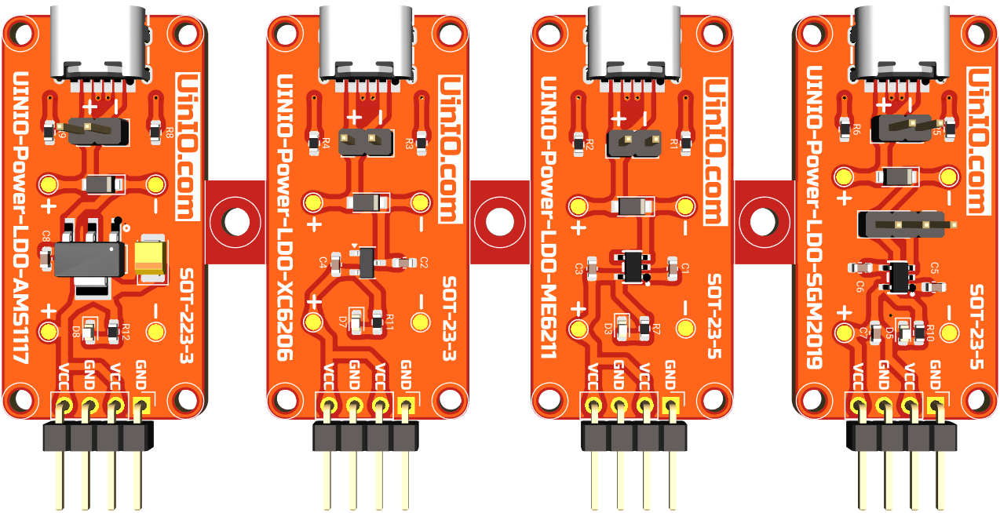
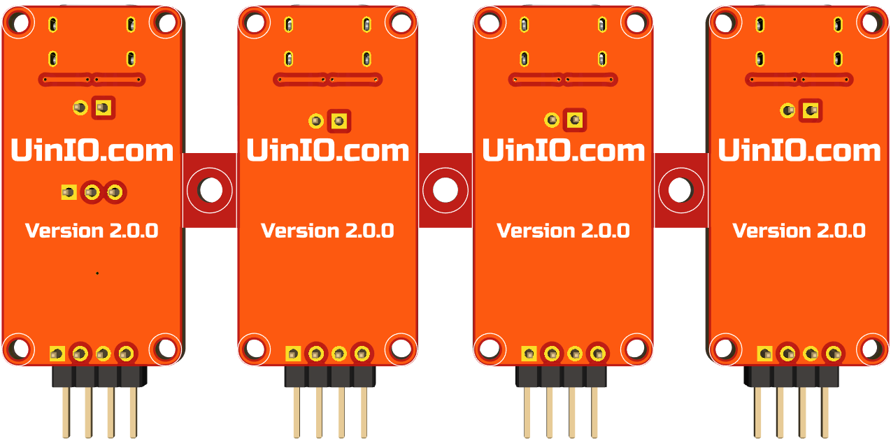

# UINIO-Power-LDO 线性稳压器模组

[**UINIO-Power-LDO**](https://gitee.com/uinika/UINIO-Power-LDO) 是一款同时支持 **XC6206**、**ME6211**、**SGM2019**、**AMS1117** 四种常用线性稳压芯片的测试模组，采用了四合一拼板设计，可以单独拆分进行使用。

## 应用介绍

1. **XC6206** 模组：选用 **SOT-23-3** 封装，兼容**特瑞仕** `XC6206` 系列低压差线性稳压器。
2. **ME6211** 模组：选用 **SOT-23-5** 封装，兼容**微盟** `ME6211` 系列低压差线性稳压器。
3. **SGM2019** 模组：选用 **SOT-23-5** 封装，兼容**圣邦微** `SGM2019` 系列低压差线性稳压器。
4. **AMS1117** 模组：选用 **SOT-223-3** 封装，可以兼容**固定电压**版本的**艾迈斯** `AMS1117`、**德州仪器** `REG1117` 线性稳压器。

> **注意**：每一片模组都单独添加了 `2mm` 直径的非金属化固定螺丝孔。

## 设计概要

1. 采用了 6 Pin 的 **USB Type-C**，并且 `CC1` 和 `CC2` 分别添加了 `5.1kΩ` 下拉电阻，可以更好的兼容具备**功率传输协议 USB-PD**（USB Power Delivery）的电源；
2. 使用 `0.7mm` 线宽 `0.3mm` 线距、`0.8mm` 过孔 `0.3mm` 孔径进行 PCB 布线，在温升 10℃ 的情况下，最大负载电流为 `1.6A` 左右，如果需要换用其它型号的线性稳压芯片，需要注意其最大输出电流不能超过该值。
3. 支持使用 `2Pin` 的杜邦针作为电源输入端口，而 `4Pin` 的杜邦针作为两路的电源输出端口。
4. 添加有一枚用于防止**输入端**反接的 **1N5819** 肖特基二极管（最大整流电流 `1A`，最大反向工作电压 `40V`），采用大尺寸的 **SOD-123** 封装，或者也可以选择载流能力达到 `3A` 的 **1N5822**。
5. 肖特基二极管和 `4Pin` 杜邦针两端，分别添加有两组测试点，便于测量输入输出的电源纹波。

> **注意**： **AMS1117** 模组的输出电容，必须采用**等效串联电阻 ESR**（Equivalent Series Resistance）更大的 `22uF` **钽电容**，从而确保输出的稳定性。

## 参考技术文档

[UinIO.com 电子技术实验室](http://uinio.com/) 为 **UINIO-Power-LDO** 开源项目提供了如下一系列技术参考资料：

- [《常见 LDO 线性稳压芯片的对比选型》](http://uinio.com/Electronics/LDO/)
- [《BOM 交互式物料清单与 PCB 布线在线预览》](http://uinio.com/archives/BOM/UINIO-Power-LDO.html)
